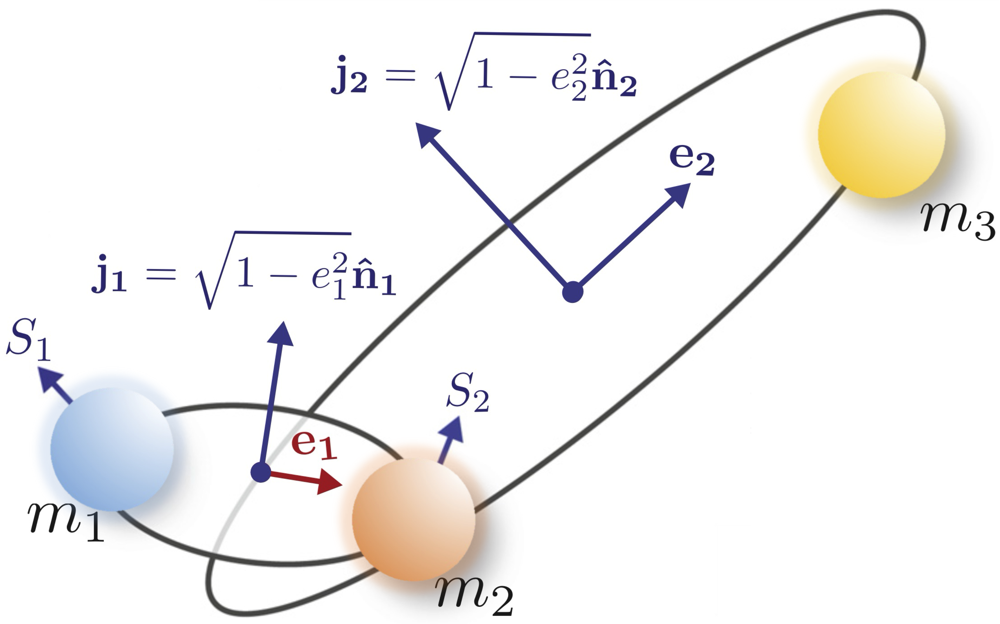
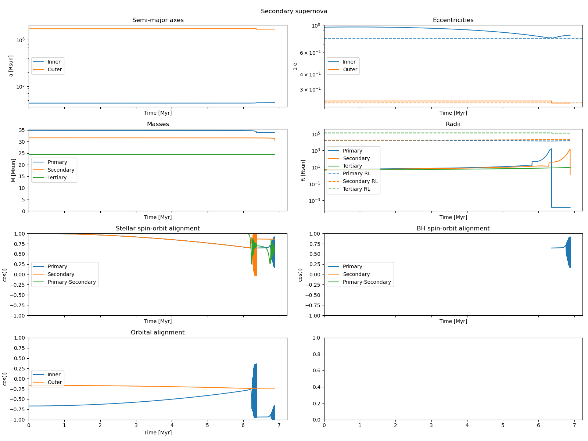

<h1 align='center'>
  TSE
  <br>
  <a href="https://doi.org/10.1093/mnras/stac2192">
      
  </a>
  <a href="mailto:jakob_stegmann@icloud.com">
      
  </a>
</h1>

<p align="center">  
  
</p>

<h2 align='center'>A Triple Stellar Evolution Code</h2>

TSE simulates the evolution of hierarchical stellar triples by simultaneously accounting for the gravitational three-body dynamics and the stellar evolution in time. The dynamics builds upon the secular, i.e., double-averaged Hamiltonian, of hierarchical three-body systems giving rise to, e.g., the [Eccentric von Zeipel-Kozai-Lidov effect](https://www.annualreviews.org/content/journals/10.1146/annurev-astro-081915-023315). Single stellar evolution and binary interactions are modelled using the binary population synthesis code [MOBSE](https://mobse-webpage.netlify.app) which builds upon the code [BSE](https://www.ascl.net/1303.014). Please refer to our [paper](https://doi.org/10.1093/mnras/stac2192) for a full description of the physics implemented to the code. We have slighlty modified the files `mobse/src/evolve.f`, `mobse/src/mobse.f`, and `mobse/input/const_mobse.h` in MOBSE. These changes are provided as a [patch](mobse.patch) ([see below](https://github.com/stegmaja/TSE/blob/main/README.md#installation)) and were only made to ensure compatibility between TSE and MOBSE, e.g., change of array lengths and MOBSE input/output, but the physical prescription of MOBSE remains unaltered.  In order to treat the stellar physics differently, using other versions of MOBSE or BSE-type codes is in general possible (but remains untested), as long as both modified files are maintained.

In this Readme file you will learn how to:
- [install TSE](https://github.com/stegmaja/TSE/blob/main/README.md#installation)
- [run TSE](https://github.com/stegmaja/TSE/blob/main/README.md#running)
- [test if TSE works correctly and learn about the terminal output](https://github.com/stegmaja/TSE/blob/main/README.md#testing-and-terminal-output) describing the most noteworthy events during the triple evolution
- [interpret additional data products (plots and tables) produced within each run](https://github.com/stegmaja/TSE/blob/main/README.md#data-products)
- [get an example how you could evolve a population of triples in parallel, e.g., on an HPC cluster managed with slurm](https://github.com/stegmaja/TSE/blob/main/README.md#parallel-runs)
- [understand the main integration variables of TSE](https://github.com/stegmaja/TSE/blob/main/README.md#integration-variables)
- [cite the code when using it for scientific publications](https://github.com/stegmaja/TSE/blob/main/README.md#citation)
- [request the implementation of new features and report bugs](https://github.com/stegmaja/TSE/blob/main/README.md#other-useful-information)

### Installation

In order to install the code follow these steps:

1. Add MOBSE, e.g., by cloning `git clone git@gitlab.com:mobse/source-code.git mobse` or by directly [downloading](https://mobse-webpage.netlify.app) the MOBSE directory. In any case, MOBSE should be added to the root directory and be named `mobse`.
2. Navigate to the `mobse` directory: `cd mobse`.
3. Implement our changes to `mobse` by `patch -p1 < ../mobse.patch`. This should notify you about patching the files `mobse/src/evolve.f`, `mobse/src/mobse.f`, and `mobse/input/const_mobse.h`.
4. Navigate to the `mobse/src` directory: `cd src`.
5. Execute the `Makefile` by running `make mobse`. You may need to change `mobse/src/Makefile` according to the specifications of your fortran compiler.
6. Navigate back to the root directory: `cd ./../..`.
7. Create two directories where the outcome of the simulation is stored, `mkdir plots data`.
8. Install all required packages by executing `pip install -r requirements.txt`.

Alternatively, simply execute `install.sh` in the root directory to do all these steps at once. You may need to change the `mobse/src/Makefile` according to the specifications of your fortran compiler. A common source of error during the installation is that you do not have [SSH keys to authenticate to the GitLab remote server](https://docs.gitlab.com/ee/user/ssh.html) in step 1. The quickest solution is to simply [download](https://mobse-webpage.netlify.app) the MOBSE directory and add it to the TSE directory.

TSE runs stably with python 3 (you can check the python version on your machine by typing `python -V`) and the package versions listed in `requirements.txt`. Depending on your machine you may have to use `python3` instead of `python` in the following.

### Running

To run a system go to the `bin` directory. Then execute

`python tse.py`.

Without specifying any further options, this evolves a triple with masses $m_1=m_2=m_3=1\rm M_\odot$, semi-major axes $a_1=2,000\rm R_\odot$ and $a_2=2\times10^5\rm R_\odot$, and eccentricities $e_1=0.1$ and $e_2=0.5$ for a maximum integration time of $100\rm Myr$. You may want to check out the number of all optional arguments, including their default values if left unspecified, by running

`python tse.py -h`

or by having a look at `src/initialconditions.py`. For instance, do 

`python tse.py --random TRUE --seed 1 --Z 0.02`

to evolve a triple from a random distribution at solar metallicity. Running `tse.py` will inform you about any noteworthy event (e.g., a mass-transfer episode or supernova explosion) in the terminal output and constantly updates thereafter a plot stored in the directory `plots` (created during the [installation](https://github.com/stegmaja/TSE/blob/main/README.md#installation)) showing masses, orbital elements, etc. as a function of time. 

If you are interested in triples leading to a particular configuration that you wish to study (e.g., the formation of BH triples) check out the function `CustomEvent` in `src/main.py` (including a working example), which can be used to terminate the integration in the event that such configuration is being achieved.

### Testing and terminal output

Let's test the code with specifying some further options and inspect the terminal output by running, e.g., `python tse.py --random TRUE --seed 139 --Z 0.0001 --stellar_tides TRUE --max_time 15000.0 --method DOP853 --bhflag 1 --nsflag 3 --lamb 0.1 --alpha1 0.2`. This will lead to a terminal output similar as following.

First, the sampled initial conditions are printed:

```
Initial conditions:
 Seed=139,
 Z=0.000100,
 m1=34.868610,
 m2=31.640159,
 m3=24.505861,
 a_in=4.320278e+04,
 e_in=0.041194,
 a_out=1.726712e+06,
 e_out=0.759993,
 cos_i_in=-0.668036,
 omega_in=1.832684,
 Omega_in=3.141593,
 cos_i_out=-0.164133,
 omega_out=6.104407,
 Omega_out=0.000000
```

Then, we get a standard MOBSE/BSE output tabulating how the inner binary would have evolved if there was no tertiary companion:

```
Evolve inner binary as if it was isolated


      TIME      M1       M2   K1 K2        SEP    ECC  R1/ROL1 R2/ROL2  TYPE
     0.0000   34.86861   31.64016  1  1    43187.60156  0.04   0.000   0.000  INITIAL 
     5.8129   34.83288   31.61894  2  1    43224.61719  0.04   0.001   0.001  KW_CHNGE
     5.8199   34.83244   31.61883  4  1    43224.97266  0.04   0.003   0.001  KW_CHNGE
     6.2848   34.65763   31.61121  4  2    43343.74609  0.04   0.040   0.001  KW_CHNGE
     6.2930   34.63868   31.61083  4  4    43356.28125  0.04   0.046   0.002  KW_CHNGE
     6.3532   34.40531   31.60643  5  4    43508.64453  0.04   0.082   0.002  KW_CHNGE
     6.3644   33.87917   31.60555 14  4    43841.69531  0.04   0.000   0.002  KW_CHNGE
     6.7871   33.87919   31.50193 14  4    43886.07031  0.04   0.000   0.021  BEG_SYMB
     6.8721   33.87977   31.33843 14  5    43994.22266  0.04   0.000   0.076  KW_CHNGE
     6.8841   33.88026   29.58524 14 14    32407.31641  0.77   0.000   0.000  KW_CHNGE
 15000.0000   33.88026   29.58524 14 14    32388.83203  0.77   0.000   0.000  MAX_TIME
 Fallback:  0.95998213867552118
```

At next, the triple is evolved. For this purpose, the stellar evolution of each star, i.e., the evolution of its mass, radius, etc., is tabulated (first the primary, then the secondary, and finally the tertiary). This is achieved by evolving each of the stars with MOBSE with some artificial low-mass black hole companion at unphysical large distance, i.e., such that the stars are effectively single. Therefore, ignore the entries for M2, K2, SEP, ECC, R1/ROL1, R2/ROL2. All we care about are M1 (and other parameters in the background) as a function of TIME. Simulatenously, the gravitional three-body dynamics is evolved.
     
``` 
Evolve triple system

Evolve single stars (ignore entries for dummy secondary)


      TIME      M1       M2   K1 K2        SEP    ECC  R1/ROL1 R2/ROL2  TYPE
     0.0000   34.86861    0.00100  1 14 63792200.00000  0.00   0.000   0.000  INITIAL 
     5.8129   34.83353    0.00100  2 14 63856440.00000  0.00   0.000   0.000  KW_CHNGE
     5.8199   34.83309    0.00100  4 14 63857256.00000  0.00   0.000   0.000  KW_CHNGE
     6.3532   34.40681    0.00100  5 14 64648368.00000  0.00   0.000   0.000  KW_CHNGE
     6.3643   33.88068    0.00100 14 14 65666576.00000  0.01   0.000   0.000  KW_CHNGE
 15000.0000   33.88068    0.00100 14 14 65629124.00000  0.01   0.000   0.000  MAX_TIME
 Fallback:   1.0000000000000000     

      TIME      M1       M2   K1 K2        SEP    ECC  R1/ROL1 R2/ROL2  TYPE
     0.0000   31.64016    0.00100  1 14 61759344.00000  0.00   0.000   0.000  INITIAL 
     6.2848   31.61115    0.00100  2 14 61816020.00000  0.00   0.000   0.000  KW_CHNGE
     6.2930   31.61073    0.00100  4 14 61816848.00000  0.00   0.000   0.000  KW_CHNGE
     6.8721   31.33694    0.00100  5 14 62356908.00000  0.00   0.000   0.000  KW_CHNGE
     6.8841   29.58371    0.00100 14 14   155942.20312 99.99   0.000  -2.000  DISRUPT 
 15000.0000   29.58371    0.00100 14 14        0.00000 -1.00   0.000   0.000  MAX_TIME
 Fallback:  0.95997883689236163     

      TIME      M1       M2   K1 K2        SEP    ECC  R1/ROL1 R2/ROL2  TYPE
     0.0000   24.50586    0.00100  1 14 56717156.00000  0.00   0.000   0.000  INITIAL 
     7.9471   24.48971    0.00100  2 14 56754564.00000  0.00   0.000   0.000  KW_CHNGE
     7.9600   24.48932    0.00100  4 14 56755456.00000  0.00   0.000   0.000  KW_CHNGE
     8.7027   24.29811    0.00100  5 14 57202060.00000  0.00   0.000   0.000  KW_CHNGE
     8.7178   14.50907    0.00100 14 14      691.86182 99.99   0.000  -2.000  DISRUPT 
 15000.0000   14.50907    0.00100 14 14        0.00000 -1.00   0.000   0.000  MAX_TIME
 Fallback:  0.59707766402046147
```
After around $6.4\rm Myr$ an event was detected which deserves further attention. Here, the primary blew off in a supernova. The code updates the orbital parameters by taking into account any supernova kicks. In that case, the system remained stable and the integration is continued ... 

```
A termination event occured.

Primary supernova at 6.3643446
Plotting...
Plot saved as ./../plots/139_00001.png
Both orbits remain bound.
```

... but the supernova of the secondary disrupted the system and the program ends.

```
A termination event occured.

Secondary supernova at 6.88413429
Plotting...
Plot saved as ./../plots/139_00001.png
Inner orbit gets unbound.

```

The total evolution of the system is plotted in the directory `plots` and stored as a csv table in the directory `data` ([see below](https://github.com/stegmaja/TSE/blob/main/README.md#data-products)).

### Data products

In each run, TSE produces a plot stored in the directory `plots` which gives an overview of some of the most important properties of the stellar triple as a function of time. Additionally, the parameters at each noteworthy event (Roche-love overflow, supernova explosion, etc.) are stored as a csv table in the directory `data`. Both files are named after the random seed and metallicity of the simulated triple, e.g., for the [tested example system](https://github.com/stegmaja/TSE/blob/main/README.md#testing-and-terminal-output) we got two files `plots/139_00001.png` and `data/139_00001.csv` indicating our options `--seed 139` and `--Z 0.0001` (the decimal point in the file names, i.e., `0.0001` becomes `00001`). The plot is constantly updated after each noteworthy event. After the [tested example system](https://github.com/stegmaja/TSE/blob/main/README.md#testing-and-terminal-output) has finished its evolution the plot should look like:

<p align="center">  
  
</p>

The plot displays the following information. As a title we have the name of the last noteworthy event. Since the integration of that particular system was terminated after the inner orbit got unbound during the secondary supernova, the title is `Secondary supernova`. Note that this title changes while the plot is being updated during the simulation. The uppermost panels show in solid lines the semi-major axes and eccentricities of the inner (blue) and outer (orange) binary. Additionally, the dashed lines in the uppermost right panel indicate the maximum eccentricity that was ever achieved during the integration. This is sometimes helpful when the eccentricity undergoes strong oscillations and you would like to see which peak caused the eccentricity maximum (i.e., minimum of $1-e$ shown in this panel). The next row of panels shows the evolution of the stellar masses and radii. Per definition the `Primary` (blue) refers to the initially more massive star in the inner binary, `Secondary` (orange) to the initially less massive star in the inner binary, and `Tertiary` (green) to the tertiary companion in the triple. Note that during the evolution the `Primary` could generally become less massive than the `Secondary`, e.g., during a mass-transfer episode. In the right panel we also show in dashed lines the Roche-lobe radii neccessary for a star to initiate a mass-transfer episode (which does not happen in this example). The next row shows the angles between the stellar spins (left) and potentially of any potentially formed black hole (right). In some more detail: In the left panel, `Primary` (blue) refers to the cosine angle of the primary spin vector and the inner orbital angular momentum vector (i.e., $\cos i=\mathbf{\hat{S}_1}\cdot\mathbf{\hat{j}_1}$), `Secondary` (orange) to the cosine angle w.r.t. the secondary spin vector (i.e., $\cos i=\mathbf{\hat{S}_2}\cdot\mathbf{\hat{j}_1}$), and `Primary-Secondary` (green) to the cosine angle between both spins (i.e., $\cos i=\mathbf{\hat{S}_1}\cdot\mathbf{\hat{S}_2}$). The right panel shows the same properties once we have black holes. In this case, only the primary formed some after $6.4\rm Myr$. Therefore, only the blue `Primary` line is shown. Lastly, the the lowermost row shows (left) the cosine angles of the inner (blue) and outer orbital angular momentum vector (orange) w.r.t. $z$ axis of the fixed reference frame. The right panel is left blank.


### Parallel runs

If you consider running a large population in parallel, consider using [gnu parallel](https://www.gnu.org/software/parallel/), e.g.,

`parallel -j 12 "python tse.py --random TRUE --seed {1} --Z {2}" ::: {1..1000} ::: 0.0002 0.002 0.02`

which would employ `-j 12` cores to evolve 1000 systems at three different metallicities (0.0002, 0.002, 0.02) in parallel. Note that it is not supported to run other parameters than seed and metallicity in parallel. If you want to explore other parameters you need to run them one after the other, e.g.,

`parallel -j 12 "python tse.py --alpha1 1.0 --random TRUE --seed {1} --Z {2}" ::: {1..1000} ::: 0.0002 0.002 0.02`

and then 

`parallel -j 12 "python tse.py --alpha1 2.0 --random TRUE --seed {1} --Z {2}" ::: {1..1000} ::: 0.0002 0.002 0.02`

and **not**

`parallel -j 12 "python tse.py --random TRUE --seed {1} --Z {2} --alpha1 {3}" ::: {1..1000} ::: 0.0002 0.002 0.02 ::: 1.0 2.0`. 

Otherwise, different threads will use the same mobse input and output files.

`src/serial_batch.sh` and `src/runtask` might be helpful scripts if you want to run the code on an HPC cluster that operates with [slurm](https://slurm.schedmd.com/overview.html).


### Integration variables

At its core, TSE integrates differential equations for the orbital elements which describe the state of the inner and outer orbit of the triple, as explained in the following. The inner orbit is described by the following seven variables:

&nbsp;&nbsp;&nbsp;&nbsp;&nbsp;&nbsp;y[0:3] : Eccentricity vector of the inner binary

&nbsp;&nbsp;&nbsp;&nbsp;&nbsp;&nbsp;y[3:6] : Dimensionless angular momentum vector of the inner binary

&nbsp;&nbsp;&nbsp;&nbsp;&nbsp;&nbsp;y[6] : Semi-major axis ($\rm R_\odot$) of the inner binary

Here, the first three are the $x$, $y$, and $z$ components of the [eccentricity vector](https://en.wikipedia.org/wiki/Eccentricity_vector) pointing towards the periapsis of the inner binary and having a lenght equal to its eccentricity. The next three variables are the components of a vector parallel to the [orbital angular momentum vector](https://en.wikipedia.org/wiki/Two-body_problem#Two-body_motion_is_planar) of the inner binary with a length equal to $\sqrt{1-e^2}$. In many papers in triples, these vectors are usually denoted as $\mathbf{e_1}$ and $\mathbf{j_1}$, respectively. Finally, the seventh variable is the semi-major axis of the inner orbit in units of $\mathrm{R}_\odot$. The next seven variables repeat these properties for the outer orbit on which the tertiary companion orbits the centre of mass of the inner binary:

&nbsp;&nbsp;&nbsp;&nbsp;&nbsp;&nbsp;y[7:10] : Eccentricity vector of the outer binary

&nbsp;&nbsp;&nbsp;&nbsp;&nbsp;&nbsp;y[10:13] : Dimensionless angular momentum vector of the outer binary

&nbsp;&nbsp;&nbsp;&nbsp;&nbsp;&nbsp;y[13] : Semi-major axis ($\rm R_\odot$) of the outer binary

Next, we have six parameters describing the roations axes of each of the inner binary stars:

&nbsp;&nbsp;&nbsp;&nbsp;&nbsp;&nbsp;y[14:17] : Rotation vector of the primary star ($1/\rm Myr$), only evolved as long as the star is not a compact object

&nbsp;&nbsp;&nbsp;&nbsp;&nbsp;&nbsp;y[17:20] : Rotation vector of the secondary star ($1/\rm Myr$), only evolved as long as the star is not a compact object

And, finally, once we have black holes, spin vectors describing the Kerr parameter. They are zero if the stars have not yet developed a black hole:

&nbsp;&nbsp;&nbsp;&nbsp;&nbsp;&nbsp;y[20:23] : BH spin vector of the primary, only evolved when the primary is a BH (norm 1, i.e., maximally spinning)

&nbsp;&nbsp;&nbsp;&nbsp;&nbsp;&nbsp;y[23:26] : BH spin vector of the secondary, only evolved when the secondary is a BH (norm 1, i.e., maximally spinning)

### Citation

When using this code for scientific publications cite

&nbsp;&nbsp;&nbsp;&nbsp;&nbsp;&nbsp;[*Stegmann J., Antonini F. & Moe M., Mon.Not.Roy.Astron.Soc. 516 (2022) 1, 1406-1427*](https://doi.org/10.1093/mnras/stac2192)

along with the papers about mobse

&nbsp;&nbsp;&nbsp;&nbsp;&nbsp;&nbsp;[*Giacobbo N. & Mapelli M., Mon.Not.Roy.Astron.Soc. (2018) 480, 2011–2030*](https://doi.org/10.1093/mnras/sty1999)

&nbsp;&nbsp;&nbsp;&nbsp;&nbsp;&nbsp;[*Giacobbo N., Mapelli M., Spera M., Mon.Not.Roy.Astron.Soc. (2018) 474, 2959–2974*](https://doi.org/10.1093/mnras/stx2933)

[Figure](https://github.com/stegmaja/TSE/blob/main/docs/sketch.png) above is adapted from [*Rodriguez C. & Antonini F., 2018 ApJ 863 7*](https://doi.org/10.3847/1538-4357/aacea4)

### Other useful information

- [Feature requests](https://github.com/stegmaja/TSE/issues/new) - Do you have a suggestion to improve TSE? Create an issue [here](https://github.com/stegmaja/TSE/issues/new) and let us know! Or, make the change yourself and create a [pull request](https://github.com/stegmaja/TSE/pulls)!
- [Bug reporting](https://github.com/stegmaja/TSE/issues/new) - If you see a bug or encounter any other problem we would love to know about it! Please create an issue [here](https://github.com/stegmaja/TSE/issues/new) or [contact us](mailto:jakob_stegmann@icloud.com) directly!
